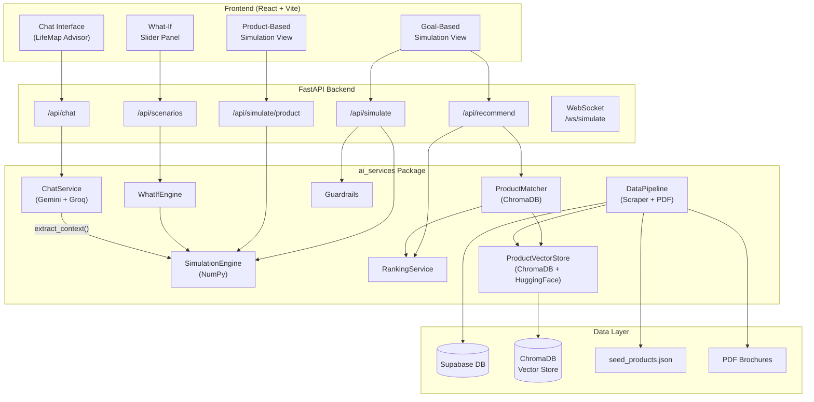
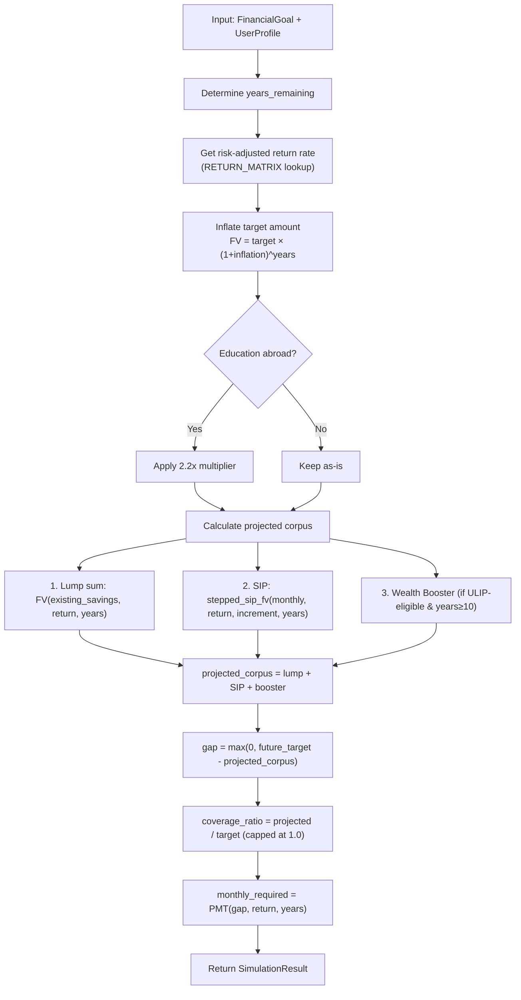
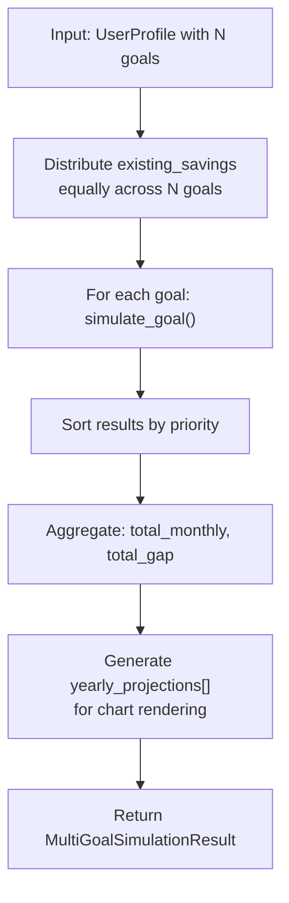
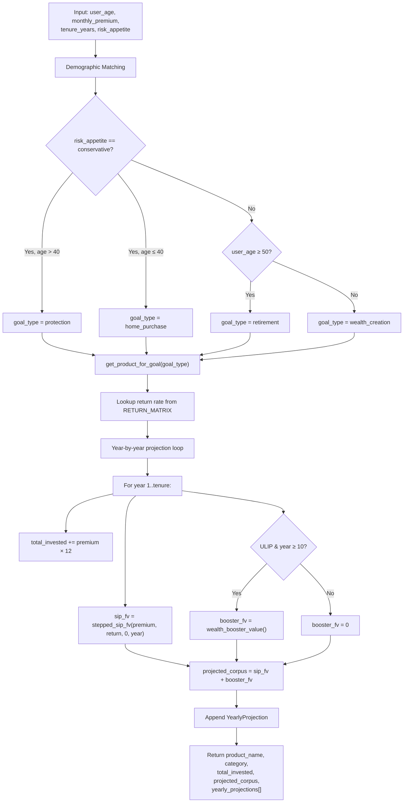
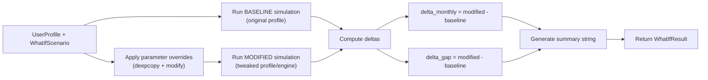
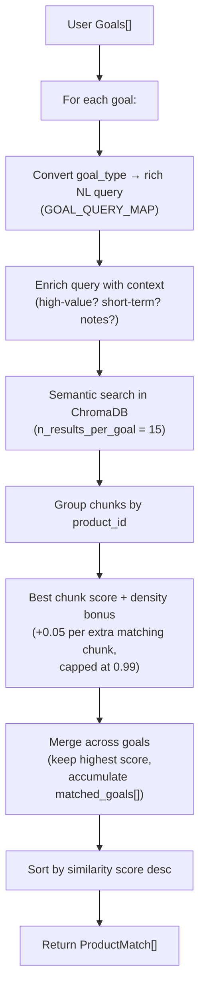
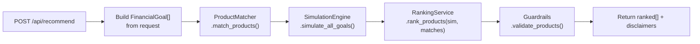
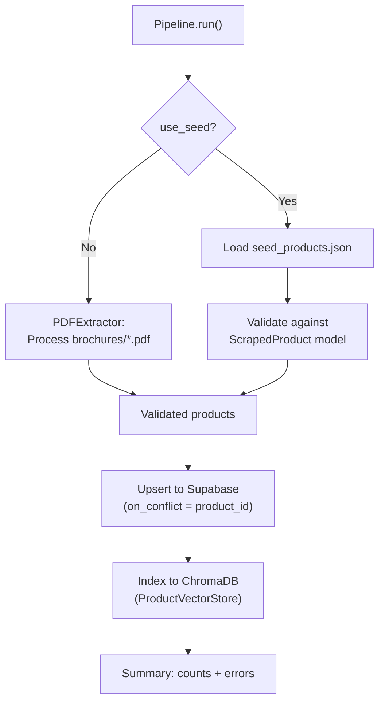
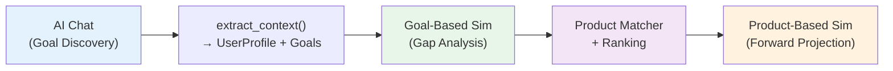

# LifeMap Insurance Simulator — Core Engine Design Deep-Dive

> **Scope**: This document explains *exactly* how every layer of the simulation, recommendation, and what-if system is designed — from mathematical formulas to data flow to API contracts to frontend rendering.

---

## Table of Contents

1. [High-Level Architecture](#1-high-level-architecture)
2. [Data Models — The Shared Contract](#2-data-models--the-shared-contract)
3. [Core Simulation Engine — Financial Math](#3-core-simulation-engine--financial-math)
4. [Goal-Based Simulation — Full Design](#4-goal-based-simulation--full-design)
5. [Product-Based Simulation — Full Design](#5-product-based-simulation--full-design)
6. [What-If Engine — Scenario Comparison](#6-what-if-engine--scenario-comparison)
7. [Product Matching & Ranking Pipeline](#7-product-matching--ranking-pipeline)
8. [Guardrails — Validation & Safety Layer](#8-guardrails--validation--safety-layer)
9. [Data Pipeline — Scrape → Index](#9-data-pipeline--scrape--index)
10. [Goal-Based vs Product-Based — Side-by-Side Comparison](#10-goal-based-vs-product-based--side-by-side-comparison)

---

## 1. High-Level Architecture



> [!IMPORTANT]
> The `ai_services` package is designed as a **standalone layer** — every class can be used independently via CLI or imported by the FastAPI backend. The API routers are thin wrappers.

---

## 2. Data Models — The Shared Contract

All data flows through Pydantic models defined in [models.py](file:///c:/Users/hp/Downloads/Goal-Based_AI_Insurance_Simulator-main/Goal-Based_AI_Insurance_Simulator-main/backend/ai_services/models.py).

### Core Input Models

| Model | Purpose | Key Fields |
|-------|---------|------------|
| `FinancialGoal` | A single life goal | `goal_type`, `target_amount`, `target_year`, `priority` (1-5), `monthly_contribution` |
| `UserProfile` | User's complete financial profile | `age`, `annual_income`, `monthly_expenses`, `risk_appetite`, `goals[]`, `dependents` |
| `WhatIfScenario` | Scenario override parameters | `scenario_name`, `modified_params{}` |

### Core Output Models

| Model | Purpose | Key Fields |
|-------|---------|------------|
| `SimulationResult` | Single-goal output | `future_value`, `monthly_savings_required`, `current_gap`, `projected_corpus`, `coverage_ratio` |
| `MultiGoalSimulationResult` | All goals aggregated | `goals[]`, `total_monthly_savings_required`, `total_gap`, `yearly_projections[]` |
| `YearlyProjection` | Year-by-year trajectory | `year`, `age`, `total_invested`, `projected_corpus` |
| `ProductMatch` | Vector similarity result | `product_name`, `similarity_score`, `matched_goals[]` |
| `RankedProduct` | Composite-scored product | `composite_score`, `similarity_score`, `goal_coverage_score`, `category_fit_score`, `reasoning` |
| `WhatIfResult` | Baseline vs modified comparison | `baseline`, `modified`, `delta_monthly_savings`, `delta_total_gap`, `summary` |
| `GuardrailResult` | Validation output | `is_valid`, `warnings[]`, `disclaimers[]`, `sanitized_data` |

---

## 3. Core Simulation Engine — Financial Math

> Source: [simulation_engine.py](file:///c:/Users/hp/Downloads/Goal-Based_AI_Insurance_Simulator-main/Goal-Based_AI_Insurance_Simulator-main/backend/ai_services/simulation_engine.py)

The `SimulationEngine` class is a **NumPy-based** financial calculator. All projections are deterministic (no Monte Carlo / stochastic).

### 3.1 Fundamental Formulas

#### Future Value (Lump Sum Compounding)

```
FV = PV × (1 + r)^n
```

Used to: Inflate goal targets to future prices, compound existing savings.

```python
# simulation_engine.py L146-148
@staticmethod
def future_value(present_value: float, rate: float, years: int) -> float:
    return float(present_value * np.power(1 + rate, years))
```

#### Present Value (Discounting)

```
PV = FV / (1 + r)^n
```

#### Monthly SIP Required (PMT)

```
PMT = FV × r_monthly / ((1 + r_monthly)^n_months - 1)
```

Used to: Calculate the monthly SIP needed to accumulate a target corpus.

```python
# simulation_engine.py L157-178
@staticmethod
def monthly_sip_required(target_amount, annual_return, years):
    monthly_rate = annual_return / 12
    total_months = years * 12
    numerator = target_amount * monthly_rate
    denominator = np.power(1 + monthly_rate, total_months) - 1
    return float(numerator / denominator)
```

#### SIP Future Value (Annuity Due)

```
FV_SIP = PMT × [((1 + r_m)^n - 1) / r_m] × (1 + r_m)
```

The `× (1 + r_m)` makes it an **annuity-due** (beginning-of-period payments).

#### Stepped SIP Future Value

Each year's SIP amount grows by `annual_increment`:

```
SIP_year_k = SIP_base × (1 + step)^k
```

Each year's 12-month SIP block is computed as a flat annuity, then compounded for the remaining years:

```python
# simulation_engine.py L203-247
for year in range(years):
    year_sip = monthly_amount * np.power(1 + annual_increment, year)
    # FV of 12 months of this year's SIP
    fv_one_year = year_sip * ((1+r_m)^12 - 1) / r_m * (1+r_m)
    # Compound for remaining years
    fv_one_year *= (1 + annual_return)^(years - year - 1)
    total_fv += fv_one_year
```

#### ULIP Wealth Booster

From ICICI Pru Signature brochure: **3.25% of average fund value** at end of every 5th year starting from year 10.

```python
# simulation_engine.py L249-278
WEALTH_BOOSTER_RATE = 0.0325
WEALTH_BOOSTER_START_YEAR = 10
WEALTH_BOOSTER_INTERVAL = 5

for yr in range(10, years+1, 5):
    fund_at_yr = sip_future_value(annual_sip/12, return, yr)
    booster = fund_at_yr * 0.0325
    booster *= (1 + return)^(years - yr)  # compound remaining
    total_booster += booster
```

#### Retirement Corpus Needed

Uses a **real-return drawdown** model:

```python
# simulation_engine.py L280-319
annual_expenses_at_retirement = FV(annual_expenses_today, inflation, years_to_retire)
real_return = ((1 + risk_free) / (1 + inflation)) - 1
corpus = expenses_at_retirement × ((1 - (1+real_return)^(-retirement_years)) / real_return)
```

### 3.2 Brochure-Backed Return Rate Matrix

Returns are **not arbitrary** — they're derived from ICICI Prudential fund performance data:

| Asset Class | Gross Return | FMC | Net Return |
|-------------|-------------|-----|------------|
| Equity (Multi Cap Growth, Focus 50) | ~12-14% | 1.35% | **11%** |
| Balanced (Active Allocation) | ~10-11% | 1.35% | **9%** |
| Debt (Income Fund, Secure Opps) | ~8-9% | 1.35% | **7%** |

The `RETURN_MATRIX` blends these based on `(risk_appetite, horizon_bucket)`:

```python
# simulation_engine.py L59-72
RETURN_MATRIX = {
    ("conservative", "short"):  0.065,   # Mostly debt
    ("conservative", "medium"): 0.070,   # 25% equity, 75% debt
    ("conservative", "long"):   0.075,   # 30% equity, 70% debt
    ("moderate", "short"):      0.070,   # 40/60
    ("moderate", "medium"):     0.085,   # 55/45 (Life Cycle age 46-55)
    ("moderate", "long"):       0.090,   # 65/35 (Life Cycle age 36-45)
    ("aggressive", "short"):    0.080,   # 60/40
    ("aggressive", "medium"):   0.100,   # 75/25 (Life Cycle age 26-35)
    ("aggressive", "long"):     0.110,   # 80/20 (Focus 50)
}
```

Horizon buckets are classified by the [_horizon_bucket](file:///c:/Users/hp/Downloads/Goal-Based_AI_Insurance_Simulator-main/Goal-Based_AI_Insurance_Simulator-main/backend/ai_services/simulation_engine.py#L104-L111) function:

| Years | Bucket |
|-------|--------|
| ≤ 5 | `short` |
| 6–12 | `medium` |
| 13+ | `long` |

> [!NOTE]
> "Conservative" goals (`protection`, `health`, `family_security`, `debt_repayment`, `family_protection`) always receive the **risk-free rate** (6.5%) regardless of the matrix.

### 3.3 Goal → Product Mapping

A static `GOAL_PRODUCT_MAP` maps each goal type to a recommended ICICI product:

```python
# simulation_engine.py L82-95
GOAL_PRODUCT_MAP = {
    "retirement":         {"name": "ICICI Pru Easy Retirement",    "category": "Retirement"},
    "child_education":    {"name": "ICICI Pru Smart Kid",          "category": "Child Plan"},
    "home_purchase":      {"name": "ICICI Pru Guaranteed Wealth",  "category": "Endowment"},
    "family_protection":  {"name": "ICICI Pru iProtect Smart",    "category": "Term Insurance"},
    "wealth_creation":    {"name": "ICICI Pru Signature",          "category": "ULIP"},
    ...
}
```

---

## 4. Goal-Based Simulation — Full Design

### 4.1 What It Is

The user defines **life goals** (retirement, child education, home purchase, etc.) and the engine computes:
- How much each goal will cost in the future (after inflation)
- How much their current savings will grow to
- The **gap** between projected and required
- The **monthly SIP** needed to close that gap
- Which product is recommended for each goal

### 4.2 Single-Goal Flow

> Entry: [SimulationEngine.simulate_goal()](file:///c:/Users/hp/Downloads/Goal-Based_AI_Insurance_Simulator-main/Goal-Based_AI_Insurance_Simulator-main/backend/ai_services/simulation_engine.py#L351-L451)



**Key design decisions:**

1. **Gap-based SIP**: The `monthly_savings_required` closes only the **gap**, not the full target. If the user already saves enough, the required SIP is ₹0.
2. **ULIP wealth boosters** only apply to eligible goal types: `retirement`, `wealth_creation`, `child_education`, `business_fund`.
3. **Education abroad multiplier** (2.2x) reflects the industry standard 2-2.5x cost difference for US/UK vs India education.

### 4.3 Multi-Goal Flow

> Entry: [SimulationEngine.simulate_all_goals()](file:///c:/Users/hp/Downloads/Goal-Based_AI_Insurance_Simulator-main/Goal-Based_AI_Insurance_Simulator-main/backend/ai_services/simulation_engine.py#L455-L569)



**Yearly projections** are computed by looping year=1..max_years and for each active goal:
1. Compounding lump-sum savings
2. Stepped SIP future value
3. Wealth booster additions
4. Summing total invested vs projected corpus

These projections power the **line chart** on the frontend showing invested vs. corpus growth over time.

### 4.4 API Layer

```
POST /api/simulate
```

> Router: [simulate.py](file:///c:/Users/hp/Downloads/Goal-Based_AI_Insurance_Simulator-main/Goal-Based_AI_Insurance_Simulator-main/backend/app/routers/simulate.py#L14-L58)
> Wrapper: [simulation_wrapper.py](file:///c:/Users/hp/Downloads/Goal-Based_AI_Insurance_Simulator-main/Goal-Based_AI_Insurance_Simulator-main/backend/app/services/simulation_wrapper.py)

**Request** ([SimulateRequest](file:///c:/Users/hp/Downloads/Goal-Based_AI_Insurance_Simulator-main/Goal-Based_AI_Insurance_Simulator-main/backend/app/schemas/simulate.py#L15-L28)):
```json
{
  "age": 30,
  "annual_income": 1500000,
  "risk_appetite": "moderate",
  "goals": [
    {
      "goal_type": "child_education",
      "target_amount": 2500000,
      "target_year": 2040,
      "priority": 1,
      "monthly_contribution": 10000
    }
  ],
  "inflation_rate": 0.06,
  "existing_savings": 500000,
  "annual_increment_percent": 0.08,
  "retirement_age": 60,
  "child_education_abroad": false,
  "expected_return_override": null
}
```

**Response**: Contains per-goal results with `recommended_product_name/category/id` attached, plus `disclaimers[]` and `warnings[]` from guardrails.

### 4.5 Real-Time WebSocket

> [simulations.py WebSocket](file:///c:/Users/hp/Downloads/Goal-Based_AI_Insurance_Simulator-main/Goal-Based_AI_Insurance_Simulator-main/backend/app/routers/simulations.py#L93-L161)

The WebSocket endpoint streams **per-goal results** as they compute, with a 100ms delay between each for animation effects on the frontend:

```
Client → { "action": "simulate", "data": {...} }
Server → { "type": "goal_result", "data": { ... per goal ... } }
Server → { "type": "goal_result", "data": { ... per goal ... } }
Server → { "type": "complete", "data": { ... full result ... } }
```

---

## 5. Product-Based Simulation — Full Design

### 5.1 What It Is

Instead of starting from goals, the user selects **product parameters** (monthly premium, tenure, risk appetite) and the engine:
- **Matches** a product based on demographics (age + risk)
- **Forward-projects** the corpus growth year by year
- Shows what they'd accumulate with that specific product

### 5.2 Engine Method

> Entry: [SimulationEngine.simulate_matched_product()](file:///c:/Users/hp/Downloads/Goal-Based_AI_Insurance_Simulator-main/Goal-Based_AI_Insurance_Simulator-main/backend/ai_services/simulation_engine.py#L599-L663)



**Key design decisions:**

1. **No inflation adjustment** — product simulation is a pure forward projection (how much your money grows), not a goal-gap analysis.
2. **No annual increment** — `annual_increment = 0.0` by default, simulating a flat premium.
3. **Demographic matching** is simple rule-based logic, not ML:
   - Conservative + Age > 40 → Protection (Term Insurance)
   - Conservative + Age ≤ 40 → Home Purchase (Endowment)
   - Age ≥ 50 → Retirement
   - Default → Wealth Creation (ULIP)

### 5.3 API Layer

```
POST /api/simulate/product
```

> Router: [simulate.py L60-87](file:///c:/Users/hp/Downloads/Goal-Based_AI_Insurance_Simulator-main/Goal-Based_AI_Insurance_Simulator-main/backend/app/routers/simulate.py#L60-L87)

**Request** ([ProductSimulateRequest](file:///c:/Users/hp/Downloads/Goal-Based_AI_Insurance_Simulator-main/Goal-Based_AI_Insurance_Simulator-main/backend/app/schemas/simulate.py#L67-L72)):
```json
{
  "monthly_premium": 10000,
  "tenure_years": 20,
  "user_age": 30,
  "risk_appetite": "moderate"
}
```

**Response** ([ProductSimulateResponse](file:///c:/Users/hp/Downloads/Goal-Based_AI_Insurance_Simulator-main/Goal-Based_AI_Insurance_Simulator-main/backend/app/schemas/simulate.py#L75-L87)):
```json
{
  "product_name": "ICICI Pru Signature",
  "product_category": "ULIP",
  "monthly_premium": 10000,
  "tenure_years": 20,
  "total_invested": 2400000,
  "projected_corpus": 7650000,
  "expected_return_rate": 0.09,
  "yearly_projections": [
    { "year": 1, "age": 31, "total_invested": 120000, "projected_corpus": 126000 },
    ...
  ]
}
```

### 5.4 Frontend — ProductSimulationView

> Source: [ProductSimulationView.tsx](file:///c:/Users/hp/Downloads/Goal-Based_AI_Insurance_Simulator-main/Goal-Based_AI_Insurance_Simulator-main/frontend/src/components/simulation/ProductSimulationView.tsx)

The component provides two sliders:
- **Monthly Premium**: ₹2,000 – ₹1,00,000
- **Investment Tenure**: 5 – 40 years

On slider change (debounced 300ms), it calls `POST /api/simulate/product`. The response is rendered as:
1. A **product banner** showing the AI-matched product name and projected corpus
2. A **wealth booster notice** (if ULIP with tenure ≥ 10 years)
3. A **projection chart** (`SimulationProjectionChart`) showing invested vs. corpus over time

If the backend is offline, it falls back to a **local mock simulation** (`runProductSimulation`).

---

## 6. What-If Engine — Scenario Comparison

> Source: [whatif_engine.py](file:///c:/Users/hp/Downloads/Goal-Based_AI_Insurance_Simulator-main/Goal-Based_AI_Insurance_Simulator-main/backend/ai_services/whatif_engine.py)

### 6.1 How It Works



### 6.2 Supported Overrides

When using `run_scenario()` with a custom `WhatIfScenario`, these parameters can be tweaked:

| Parameter | What It Does |
|-----------|-------------|
| `inflation_rate` | Changes the inflation assumption |
| `expected_return` | Overrides expected market return |
| `retirement_age` | Changes retirement target age |
| `life_expectancy` | Changes post-retirement planning horizon |
| `savings_increase_pct` | Multiplies all monthly contributions by `(1 + pct)` |
| `remove_goal` | Removes a specific goal by type |
| `add_goal` | Adds a new `FinancialGoal` to the profile |

### 6.3 Predefined Templates

Six built-in scenarios via `run_template()`:

| Template Key | Description | Modifier |
|-------------|-------------|----------|
| `delay_retirement_5y` | Retire 5 years later | `retirement_age += 5`, push retirement goal year |
| `increase_savings_20pct` | Save 20% more monthly | All `monthly_contribution *= 1.20` |
| `increase_savings_50pct` | Save 50% more monthly | All `monthly_contribution *= 1.50` |
| `higher_inflation` | Inflation rises to 8% | `engine.inflation_rate = 0.08` |
| `lower_returns` | Conservative returns at 7% | `engine.expected_return = 0.07` |
| `add_emergency_fund` | Add a 6-month emergency goal | Appends a new goal: `6 × monthly_expenses`, priority 1, 2 years |

---

## 7. Product Matching & Ranking Pipeline

### 7.1 Vector Store

> Source: [vectorstore.py](file:///c:/Users/hp/Downloads/Goal-Based_AI_Insurance_Simulator-main/Goal-Based_AI_Insurance_Simulator-main/backend/ai_services/vectorstore.py)

- **Database**: ChromaDB (persistent, cosine similarity)
- **Embedding model**: HuggingFace `all-MiniLM-L6-v2` (local, no API calls)
- **Chunking**: Products are indexed as multiple chunks (from PDF brochure text) or a single enriched text string (from seed data)
- **Metadata** stored per chunk: `product_id`, `product_name`, `category`, `description`, `goals_supported`, `key_benefits`

### 7.2 ProductMatcher

> Source: [product_matcher.py](file:///c:/Users/hp/Downloads/Goal-Based_AI_Insurance_Simulator-main/Goal-Based_AI_Insurance_Simulator-main/backend/ai_services/product_matcher.py)



**Goal → Query examples:**

| Goal Type | Generated Query |
|-----------|----------------|
| `retirement` | "retirement pension plan with guaranteed income and long-term savings" |
| `child_education` | "child education plan for future college and school fees savings" |
| `protection` | "term insurance with high life cover and family protection" |

### 7.3 RankingService

> Source: [ranking_service.py](file:///c:/Users/hp/Downloads/Goal-Based_AI_Insurance_Simulator-main/Goal-Based_AI_Insurance_Simulator-main/backend/ai_services/ranking_service.py)

Products are scored with a **weighted composite** (0–100 scale):

```
composite = (similarity × 0.40 + goal_coverage × 0.30 + category_fit × 0.30) × 100
```

| Factor | Weight | How It's Computed |
|--------|--------|-------------------|
| **Similarity** | 40% | From ChromaDB cosine distance, converted to 0–1 |
| **Goal Coverage** | 30% | `matched_goals_count / total_user_goals` |
| **Category Fit** | 30% | Average affinity from `CATEGORY_GOAL_AFFINITY` matrix |

**Category-Goal Affinity Matrix** (excerpt):

| Category | retirement | child_education | protection | wealth_creation |
|----------|-----------|-----------------|------------|-----------------|
| term_insurance | 0.1 | 0.1 | **1.0** | 0.0 |
| ulip | 0.8 | 0.8 | 0.3 | **0.9** |
| retirement | **1.0** | — | — | 0.5 |
| child | — | **1.0** | 0.5 | 0.4 |

Each ranked product gets a human-readable `reasoning` string, e.g.:
> "Strong semantic match to your goals. Covers 2 of your goals. 'ulip' is an excellent category fit."

### 7.4 Full Recommendation Pipeline (API)

> Router: [recommend.py](file:///c:/Users/hp/Downloads/Goal-Based_AI_Insurance_Simulator-main/Goal-Based_AI_Insurance_Simulator-main/backend/app/routers/recommend.py)
> Wrapper: [recommend_wrapper.py](file:///c:/Users/hp/Downloads/Goal-Based_AI_Insurance_Simulator-main/Goal-Based_AI_Insurance_Simulator-main/backend/app/services/recommend_wrapper.py)



---

## 8. Guardrails — Validation & Safety Layer

> Source: [guardrails.py](file:///c:/Users/hp/Downloads/Goal-Based_AI_Insurance_Simulator-main/Goal-Based_AI_Insurance_Simulator-main/backend/ai_services/guardrails.py)

### 8.1 Sanity Check Thresholds

| Metric | Min | Max |
|--------|-----|-----|
| Monthly SIP | ₹100 | ₹10,00,000 |
| Corpus value | ₹10,000 | ₹1,000 Cr |
| Coverage ratio | 0.0 | 1.0 |
| Inflation rate | 1% | 20% |
| Expected return | — | 25% |
| Horizon | — | 80 years |

Values exceeding these bounds generate `warnings[]` and are clamped in `sanitized_data`.

### 8.2 Standard Disclaimers

Every simulation response includes these mandatory disclaimers:
1. All projections are estimates based on assumed rates
2. Past performance does not guarantee future results
3. Insurance is subject to solicitation
4. Tax benefits subject to change
5. Not professional financial advice

Plus a **dynamic disclaimer** interpolated with actual rates used:
> "⚠️ Disclaimer: The numbers shown are projections based on assumed rates (6.0% inflation, 9.0% returns)."

### 8.3 LLM Fallback

The `with_fallback()` static method provides a retry-with-exponential-backoff pattern for LLM calls:

```
Primary (Gemini) → Retry 1 (2× delay) → Retry 2 (4× delay) → Fallback (Groq/Llama)
```

Retries only on: `rate`, `429`, `quota`, `timeout`, `503`, `overloaded`.

---

## 9. Data Pipeline — Scrape → Index

> Source: [pipeline.py](file:///c:/Users/hp/Downloads/Goal-Based_AI_Insurance_Simulator-main/Goal-Based_AI_Insurance_Simulator-main/backend/ai_services/pipeline.py) + [scraper.py](file:///c:/Users/hp/Downloads/Goal-Based_AI_Insurance_Simulator-main/Goal-Based_AI_Insurance_Simulator-main/backend/ai_services/scraper.py)



**Scraper** (Playwright): Visits ICICI Pru website → extracts product cards → visits each product page → scrapes name, description, features, eligibility → downloads brochure PDFs.

**PDF Extractor**: Processes downloaded/manual brochure PDFs into structured `ScrapedProduct` objects with `raw_chunks[]` for fine-grained vector indexing.

---

## 10. Goal-Based vs Product-Based — Side-by-Side Comparison

| Aspect | Goal-Based Simulation | Product-Based Simulation |
|--------|----------------------|-------------------------|
| **User Input** | Life goals (retirement, education, etc.) with target amounts and years | Monthly premium + tenure + risk appetite |
| **Starting Point** | "What do I need?" | "What will this product give me?" |
| **Engine Method** | `simulate_goal()` / `simulate_all_goals()` | `simulate_matched_product()` |
| **Inflation** | ✅ Target amount is inflation-adjusted | ❌ Not applied (pure forward projection) |
| **Gap Analysis** | ✅ Computes shortfall and required SIP | ❌ No gap concept — just shows growth |
| **Multiple Goals** | ✅ Handles N goals with priority ordering | ❌ Single product at a time |
| **Return Rate** | Risk-aware from `RETURN_MATRIX` by goal type + horizon | Risk-aware from `RETURN_MATRIX` by matched goal |
| **Product Selection** | Static `GOAL_PRODUCT_MAP` lookup per goal | Demographic rule-based matching (age + risk → goal → product) |
| **Stepped SIP** | ✅ Supports `annual_increment` | ❌ Flat premium only |
| **Wealth Boosters** | ✅ For ULIP-eligible goals only | ✅ For ULIP products with tenure ≥ 10 |
| **Existing Savings** | ✅ Compounded as lump sum | ❌ Not supported |
| **Output** | `SimulationResult` with gap, coverage, SIP required | `dict` with product name, total invested, projected corpus |
| **Chart Data** | Yearly: invested + corpus for all goals combined | Yearly: invested + corpus for single product |
| **API Endpoint** | `POST /api/simulate` | `POST /api/simulate/product` |
| **Frontend Component** | `WhatIfPanel` + goal cards | `ProductSimulationView` with premium/tenure sliders |
| **Guardrails** | ✅ Full validation + disclaimers | ⚠️ Basic (no guardrail wrapper currently) |
| **Session Saving** | ✅ Saved to Supabase `simulation_sessions` | ❌ Not persisted |

### Design Philosophy

> [!TIP]
> **Goal-based** is the primary user flow — it answers "Am I on track for my life goals?" and identifies gaps. The AI chat extracts goals conversationally, then the engine quantifies the financial plan.
>
> **Product-based** is a secondary exploration flow — it answers "What would this specific product do for me?" and lets users experiment with premium/tenure sliders. It's a forward-projection calculator, not a planning tool.

### How They Connect



1. User chats with **LifeMap Advisor** → goals are extracted into `UserProfile`
2. **Goal-Based Simulation** shows the financial gap for each goal
3. **Product Matching + Ranking** recommends the best products for those goals
4. User can then drill into **Product-Based Simulation** to explore a specific product's performance
